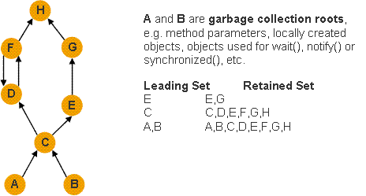

# Ecipse Memory Analyzer 1.6.1  MAT(Memory Analyzer Tool)
* 看线程：会生成一个名称 *.threads的文件
* 或按第五个图标(thread overview，可查看出哪个线程占的内存多，是不是守护线程，应用程序创建为非守护线程)

* shallow heap (弱)
is the memory consumed by on one object. 64 bits per reference, 4 bytes per integer... 
* retained heap (保留)
of X is the sum of shallow sizes of all objects in the retained set of X., ie. memor kept alive by X.

Generally speaking, shallow heap of an object is its size in the heap and 
retained heap size of the same object is the amount of heap memory that will be freed when the object is garbage collected.

